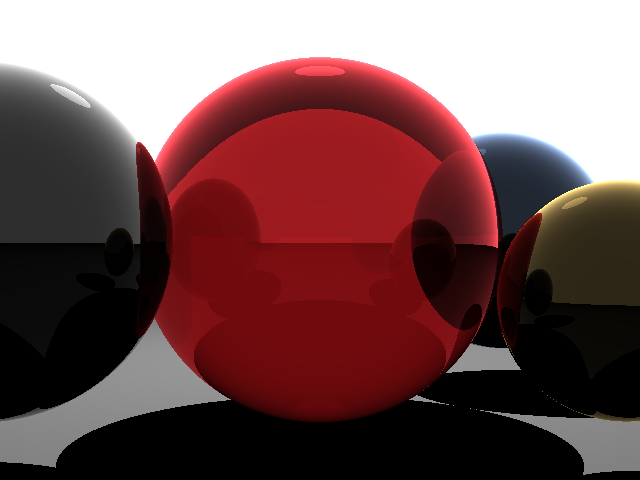

# 🌌 Simple 3D Raytracer

A basic **raytracer written in C++** that renders simple 3D spheres with reflections, transparency, and lighting.  
The output is generated as a `.ppm` image, which can also be converted to `.png` for easier viewing.

---

## ✨ Features
- Ray-sphere intersection
- Diffuse shading
- Reflection and refraction
- Simple lighting model
- Outputs result as `untitled2.ppm`

---

## 📸 Sample Output

Here is a rendered image from the raytracer:



---

## 🛠 Requirements
- A C++ compiler (g++, clang++, or MSVC)
- Works on **Linux, macOS, and Windows**
- (Optional) [ImageMagick](https://imagemagick.org) for converting `.ppm` → `.png`

---

## 🚀 Build & Run

// [compile]
```bash
### On Linux / macOS
```bash
# Compile with your preferred compiler
c++ -O3 -Wall -o raytracer raytracer.cpp
clang++ -O3 -Wall -o raytracer raytracer.cpp
g++ -O3 -Wall -o raytracer raytracer.cpp

# Run
./raytracer
```
On Windows (MinGW)
```bash
# Compile
g++ -O3 -Wall -o raytracer.exe raytracer.cpp

# Run
raytracer.exe
```

Convert .ppm to .png (optional):
```bash
magick untitled2.ppm untitled2.png
```

🖼 Output & Conversion

After running, the program generates:

untitled2.ppm

You can:
1. Open .ppm with GIMP, IrfanView, Photoshop, or
2. Convert it to PNG/JPG using ImageMagick:
``` bash
magick untitled2.ppm untitled2.png
```
📖 Credits

This project is adapted from the tutorial and source code by Scratchapixel:
👉 Introduction to Ray Tracing

Original code © 2012 Scratchapixel.com, distributed under the GNU General Public License v3.0.
I modified it for learning purposes (Windows compatibility, file handling, and experimenting with rendering).

---

